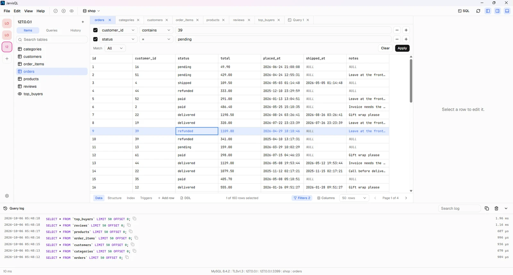

  <picture>
    <source media="(prefers-color-scheme: dark)" srcset="assets/logo-dark.png">
    
  </picture>

  A fast, modern desktop client for SQLite, MySQL, PostgreSQL and more. 
  Open local files, or databases on remote servers over SSH.

  
  
  

  <a href="https://github.com/fftfaisal/jarvisql-releases/releases/latest"><b>Download</b></a>
  &nbsp;·&nbsp;
  <a href="https://jarvisql.faisal.com.bd">Website</a>

  <picture>
    <source media="(prefers-color-scheme: dark)" srcset="docs/assets/app-dark.webp">
    
  </picture>

---

## Why JarvisQL

- **Small and quick.** The installer is about 5 MB.
- **Local and remote.** Open a file on your computer, or one on a server over SSH with a password or a private key.
- **Careful with your data.** Edits are collected first, so you can review every change before it is saved.
- **Private.** No account and no analytics. Passwords are kept in your system keychain, never in a file.

## Features

**Connections**
- Saved connections with groups, colors, and tags. Drag to reorder.
- SQLite files on your computer.
- SQLite files on a server over SSH, with host key checking.
- MySQL servers, with SSL (including CA, client certificate and key files) and connections through an SSH tunnel.
- A database picker: every database on a server opens as its own connection. Create or drop databases from it.
- Passwords and key passphrases stored in Windows Credential Manager, macOS Keychain, or the Linux Secret Service.

**Browse and edit**
- Tables and views with sorting, filters, and paging. Choose how many rows to show, and start at any row.
- Show or hide columns.
- Edit cells in place, add, duplicate, or delete rows, then review all pending changes before you save.
- Rows are matched by primary key, big numbers stay exact, and binary cells show a hex preview.
- Clone or truncate a table from its right-click menu.
- Structure, index, trigger, and DDL views. Change a table's structure with a preview of the SQL before it runs.

**SQL editor**
- Query tabs with autocomplete for tables and columns.
- Run the current statement or all of them. Every result opens in its own tab.
- Beautify, saved queries, and history for each connection.
- A query log with timings and syntax colors.

**Import and export**
- Import CSV, JSON, and SQL files.
- Export tables or whole databases as CSV, JSON, or SQL.
- Big files are streamed, with progress and a Cancel button.

**And more**
- Light, dark, and system themes, with font settings.
- Updates inside the app.
- Keyboard shortcuts for the everyday actions.

## Install

| System | Download |
| --- | --- |
| Windows | `JarvisQL_x.y.z_x64-setup.exe` |
| macOS, Apple silicon | `JarvisQL_x.y.z_aarch64.dmg` |
| macOS, Intel | `JarvisQL_x.y.z_x64.dmg` |
| Linux | `JarvisQL_x.y.z_amd64.AppImage` or `.deb` |

Get the latest files from the [releases page](https://github.com/fftfaisal/jarvisql-releases/releases/latest).

The installers are not code-signed yet, so your system may ask you to confirm the first launch:

- **Windows:** if SmartScreen says "Windows protected your PC", click **More info**, then **Run anyway**.
- **macOS:** right-click the app, choose **Open**, then **Open** again.
- **Linux:** for the AppImage, make it executable first with `chmod +x`.

## Updates

JarvisQL checks for new versions and installs them for you. You can also check at any time from **Help**, then **Check for updates**.

## Your data

Connections, saved queries, and settings are stored in the `.jarvisql` folder in your home directory. Your databases are never copied anywhere else. For a database on a server, JarvisQL works on a temporary local copy and uploads it back only when you choose to.

## Feedback

Found a bug, or have an idea? [Open an issue](https://github.com/fftfaisal/jarvisql-releases/issues/new).

---

  Made by <a href="https://faisal.com.bd">Faisal Ahmed</a>

